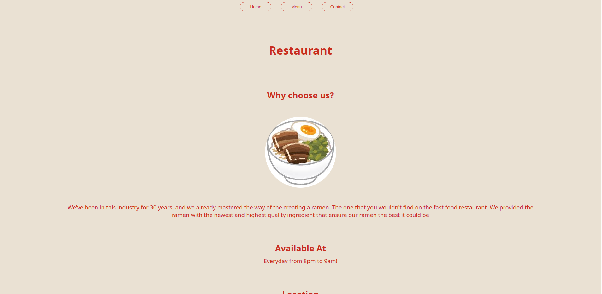

# restaurant-page

Users should be able to

- Change the page content from the navigation tab
- View the static content

## Screenshot



## Link

- Live Preview: [url](https://azanra.github.io/restaurant-page/)

## Built with

- ES6 Modules
- Bundled with webpack

## What i learned

Using package manager like npm, which is repository of library, plugin, tools that will be used for development that you can import to your project. To set it up, it uses configuration from the package.json that contain information of your project, and the dependency that this project use including it's spesific version that it use, when your run npm. it will try to install it based on package.json configuration. And all the package will be included in node_modules file.

When we have multiple modules in our project, we can merge it all into single modules with webpack. to use webpack you need to configure it with webpack.config which contain infromation like

- Development mode: either development or production
- Entry point: which is the file (eg main.js) that import from another file (eg module.js) and depending on it. it will create dependency graph like this
  main.js <---- module.js

and webpack will use the dependency graph to not included modules that is not been used.

- Output: the location of where our bundled file will be
- Devtool. devServer: It will immediately update the bundle output, without the need to run the webpack on each change that we made on the file,
  because they only watch js file by default, we also ask to watch for the change in html. For the source map, it will used so that any error will reference actual line or file instead of the bundled file

- Plugin : More flexible version of modules that is used to solve some problem. in this case it will ask to process and bundled and inject js to the html

- Module, rules: The loader that is been used, it will look for any import that test specified in the javascript and process / transform it into js file
  that specified in the use / type( built it loader)

All bundled file will be in the dist file based on this config that will be used for deployment, while for uploading it to the repository, we doesn't need to include
the dist file, since they can run their own bundling to product their own dist

```js
const path = require("path");
const HtmlWebpackPlugin = require("html-webpack-plugin");
const { watchFile } = require("fs");

module.exports = {
  mode: "development",
  entry: "./src/index.js",
  output: {
    filename: "main.js",
    path: path.resolve(__dirname, "dist"),
    clean: true,
  },
  devtool: "eval-source-map",
  devServer: {
    watchFiles: ["./src/template.html"],
  },
  plugins: [
    new HtmlWebpackPlugin({
      template: "./src/template.html",
    }),
  ],
  module: {
    rules: [
      {
        test: /\.css/i,
        use: ["style-loader", "css-loader"],
      },
      {
        test: /\.(png|svg|jpg|jpeg|gif)$/i,
        type: "asset/resource",
      },
    ],
  },
};
```
